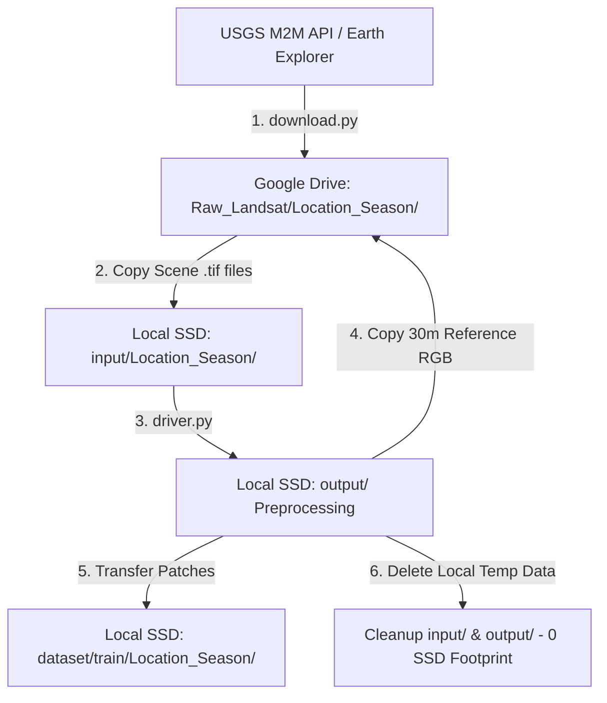

# 🚀 Bhartiya Antriksh Hackathon (BAH) 2026

## Problem Statement: Infrared Image Colorization and Enhancement for Improved Object Interpretation

Welcome to the **Bhartiya Antriksh Hackathon 2026**! This repository provides an automated, decoupled 3-stage architecture to extract Landsat 8/9 satellite imagery from USGS M2M API directly to Google Drive, and build coregistered training patches on a local SSD with minimal disk footprint.

---

## 🏗️ 3-Stage Decoupled Technical Architecture



### 1. Stage 1: Downloader (`download.py`)
- **Purpose:** Searches USGS M2M API for 14 curated locations across 7 scenic types (Urban, Agriculture, Forest, Desert, Mountains, Coast, Wetlands).
- **Execution:** Downloads raw scene `.tar` archives into a local fast SSD `temp_download/` folder, extracts the 6 required bands (`SR_B2`, `SR_B3`, `SR_B4`, `SR_B5`, `ST_B10`, `QA_PIXEL`), and transfers final `.tif` files directly into Google Drive (`Raw_Landsat/<Location_Season>/`).
- **Resilience:** Automatic retry logic (up to 3 attempts) for corrupt or truncated `.tar` archive downloads. Supports custom `cloud_cover` thresholds (e.g. `20%` for Swiss Alps Winter to prevent snow-cloud misclassification skipping).

### 2. Stage 2: Dataset Builder (`dataset_builder.py`)
- **Purpose:** Incremental orchestrator that processes scenes from Google Drive one by one.
- **Workflow:**
  1. Copies scene `.tif` files from Google Drive to local SSD `input/<Location_Season>/`.
  2. Executes local preprocessing pipeline (`driver.py`).
  3. Copies reference 30m RGB TIFF (`<Location_Season>_rgb_30m.tif`) back to Google Drive scene folder (`Raw_Landsat/<Location_Season>/`).
  4. Moves generated coregistered dataset patches to `dataset/train/<Location_Season>/`.
  5. Cleans up local `input/` and `output/` folders to keep local SSD space usage tiny at all times.

### 3. Stage 3: Preprocessing & Patching (`driver.py`)
- **Purpose:** Spatially aligns optical and thermal infrared bands.
- **Data Flow:**
  - Merge B2, B3, B4 into 30m RGB.
  - Downscale 30m RGB $\xrightarrow{\times 3.33}$ 100m.
  - Downscale 30m TIR (B10) $\xrightarrow{\times 3.33}$ 100m.
  - Downscale 30m TIR (B10) $\xrightarrow{\times 6.67}$ 200m.
  - Extract co-registered patch pairs:
    - Super-Resolution: 256x256 (200m TIR) $\rightarrow$ 512x512 (100m TIR).
    - Colorization: 256x256 (100m TIR) $\rightarrow$ 256x256 (100m RGB).

---

## ⚡ Quick Start Guide

### 1. Installation & Environment Setup
Clone the repository and install the dependencies:
```bash
pip install -r requirements.txt
```

### 2. Configure USGS Credentials & Drive Path
Copy `download_config.example.yaml` to `download_config.yaml` (which is gitignored to protect sensitive credentials):
```bash
cp download_config.example.yaml download_config.yaml
```
Open `download_config.yaml` and set your credentials & target drive path:
```yaml
usgs_username: "YOUR_USGS_USERNAME"
usgs_password: "YOUR_USGS_PASSWORD"
raw_landsat_dir: "G:/My Drive/Raw_Landsat"
```
*Alternatively, you can set `USGS_USERNAME` and `USGS_PASSWORD` environment variables.*

### 3. Run Stage 1: Downloader
Download all 14 Landsat scenes from USGS to Google Drive:
```bash
python download.py
```

### 4. Run Stage 2: Dataset Builder
Process raw Google Drive scenes into coregistered training patches on local SSD:
```bash
python dataset_builder.py
```

Or run the shell wrapper:
```bash
chmod +x scripts/download_data.sh
./scripts/download_data.sh
```

---

## 📊 Curated Location Matrix (14 Locations)

| Scenic Type | India Location | Abroad Location | Season / Criteria |
| :--- | :--- | :--- | :--- |
| **Urban** | Mumbai, IN | NewYorkCity, US | Summer / Winter |
| **Agriculture** | Punjab, IN | Iowa, US | Growing / Harvest |
| **Forest** | WesternGhats, IN | BlackForest, DE | Summer / Autumn |
| **Desert** | Thar, IN | Atacama, CL | Summer / Winter |
| **Mountains** | Ladakh, IN | SwissAlps, CH | Summer / Winter (Cloud limit: 20%) |
| **Coast** | Chennai, IN | Sydney, AU | Summer / Winter |
| **Wetlands** | Sundarbans, IN | Everglades, US | Summer / Winter |

---

## 🎯 Mandatory Output Format for Evaluation

For inference, your model outputs must be organized under `output/model_outputs/`:

```
output/
└── model_outputs/
    ├── tir_superresolved_100m/
    │   └── <product_id>.tif
    └── colorized_tir_100m/
        └── <product_id>.tif
```

**Colorized TIR Channel Sequence:**
- Layer 1: Blue
- Layer 2: Green
- Layer 3: Red
